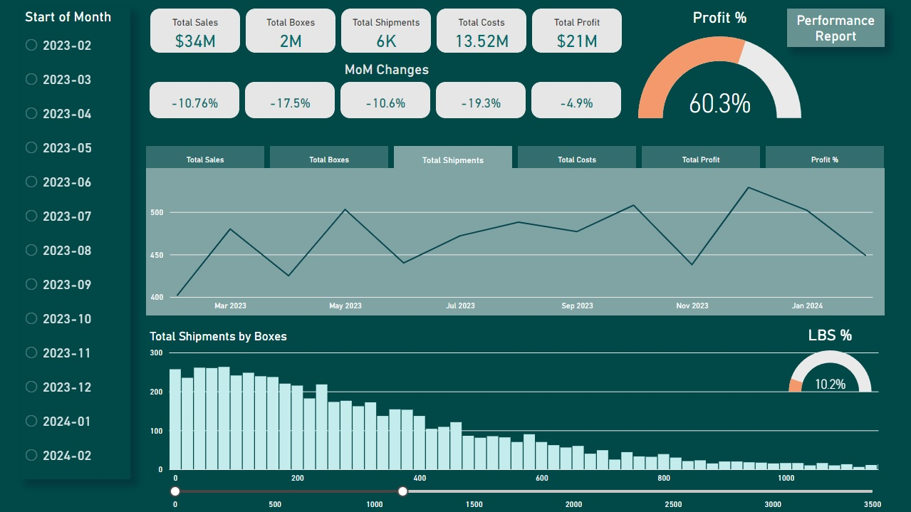
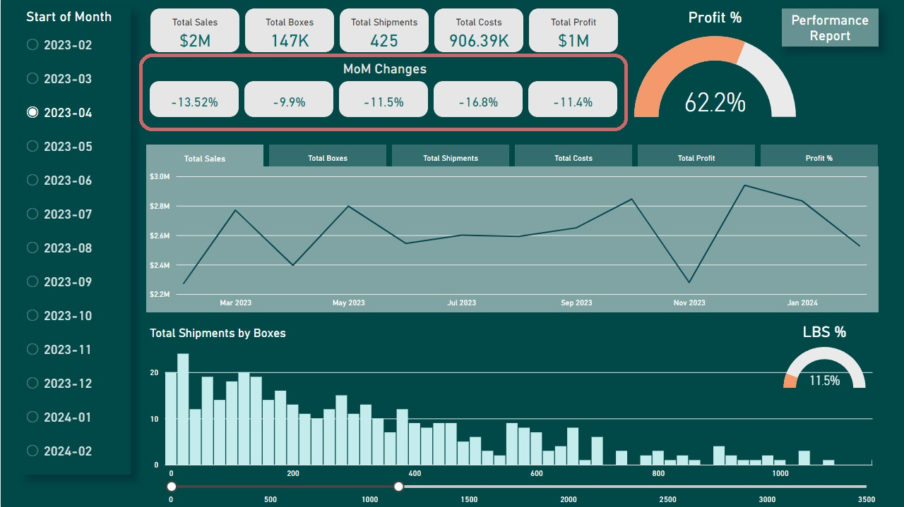
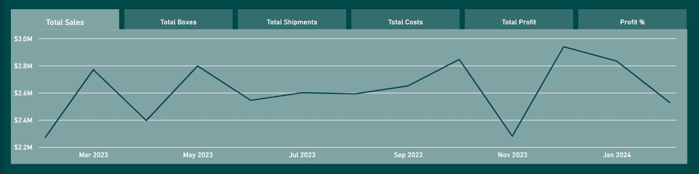
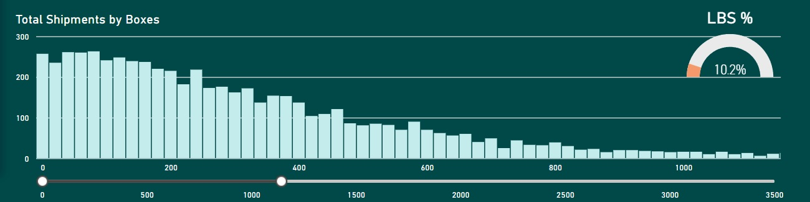
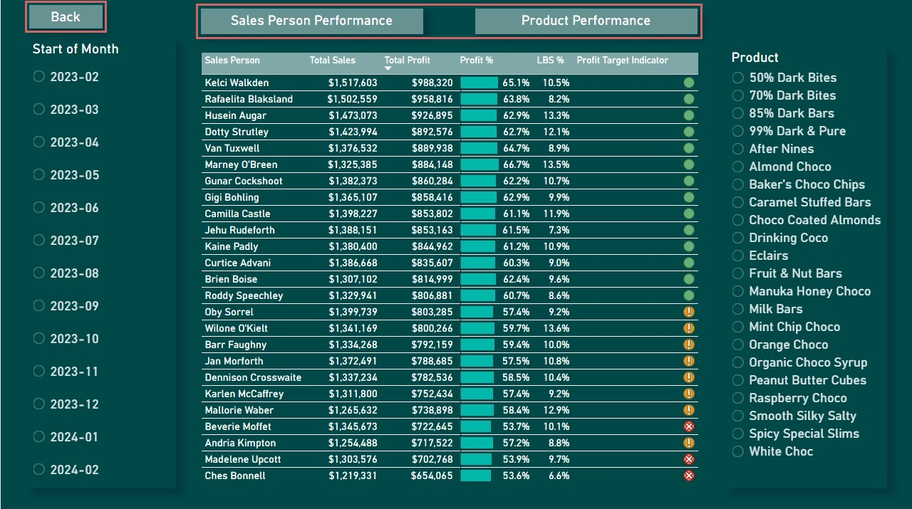
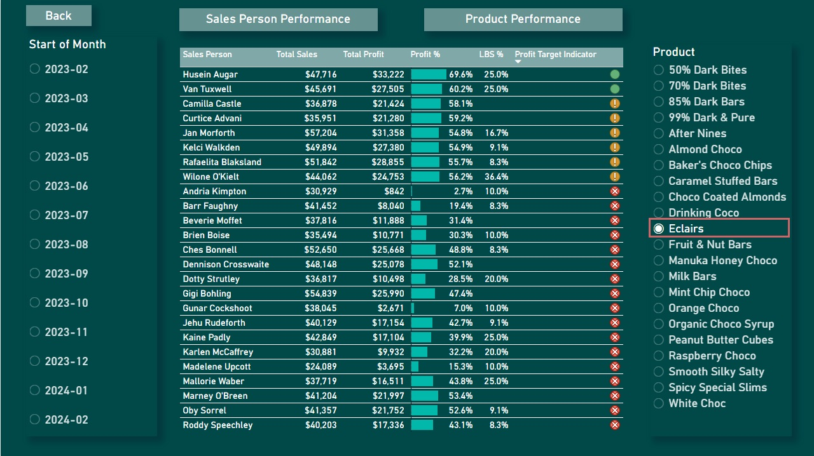
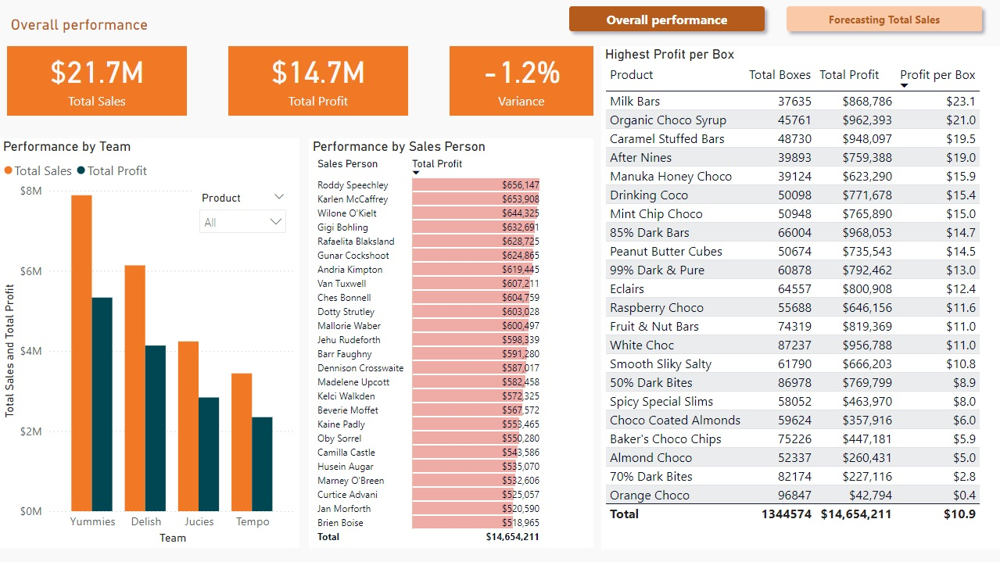
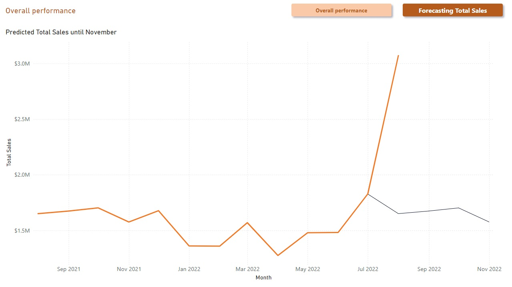

# Introduction
 In this project, I followed two PowerBI workshosp by Chandoo, available [here](https://www.youtube.com/watch?v=8tfcVnoEL0c&list=PLmejDGrsgFyDMME3o2CamamZ8w9NxSWWo&index=10). Throughout the process, I made some adjustments based on my personal preferences.

 # Project 2. - Trends and Performance Analysis

 The projects being overlapping, I have decided to describe the more complex project first. This dataset did not required data preparation as PowerBI interpreted the tables correctly but I had to create the star schema as some table connections were not made automatically.

 ## Questions

 - Major sales indicators and MoM changes 
 - Line charts showcasing main trends
 - Distribution of box sizes
 - Performance reports on staff and products

While the questions seems to be identical, this analysis is more in-dept and uses more DAX measures and PowerBI features to enhance to user experience and to highlight important marketing measures like MoM changes.


## Analysis

### Creating Measures

In order to create the missing marketing indicators, I had to use SUM, DIVIDE, CALCULATE, COUNTROWS, LASTDATE, PREVIOUSMONTH and IF functions. I created card visuals for each major sales indicator, except for profit % which is in spotlight as a gauge.

Examples:
```
Total Shipments = COUNTROWS(shipments)
```
```
Total Sales = SUM(shipments[Sales])
```
```
Total Profit = [Total Sales] - [Total Costs]
```
```
Profit Target Indicator = 
    IF([Profit %]>[Profit Target], 2, 
    IF([Profit %]>0.9*[Profit Target], 1, 
    0))
```
```
LBS Count = CALCULATE([Total Shipments], shipments[Boxes] < 50)
```
```
LBS % = DIVIDE([LBS Count], [Total Shipments])
```
```L
Last Date = LASTDATE('calendar'[Start of Month])
```


### Calculated Group - MoM Changes

As MoM Changes is calculated with the same logic for several fields - sales, profit, shipment, etc - it is best practice to use Calculated Groups, as you can see below:

```
Latest MoM Change % = 
var ld = [Last Date]
var pd = EDATE(ld,-1)
var this_month = CALCULATE(SELECTEDMEASURE(), 'calendar'[Start of Month]=ld)
var prev_month = CALCULATE(SELECTEDMEASURE(), 'calendar'[Start of Month]= pd)
return
DIVIDE(this_month-prev_month, prev_month)
```
I created cards in the centre of the main page where stakeholders can see the MoM changes.



### Field parameters to showcase trends

I utilized field parameters to create one line chart that can showcase each main trend one by one on the same timeline. 



### Bins to see the box size distribution

I visualised the distribution of different box sizes among all shipments and I created bins with the size of 20 for that, and added a zoom slider for making it possible to filter for distinct ranges. Stakeholders are even informed about the LBS (low box size) % for each month. 



### Bookmarks for navigation

To avoid information overload, I have created separate page for the performance report and I created bookmarks not only to navigate between trends and performance reports but also to switch between sales person performance and product performance.




### Performance Reports

I created tables to examine the performance of each sales person and each product. Beside the marketing measures, I added a last column with conditional formatting to highlight if they reached the target or not.



# Project 1. - Sales Analysis
## Data Preparation

The target.csv file was imported incorrectly, with Power BI creating column headers such as Column1, Column2, etc. To resolve this, I transformed the first row (containing Sales Person, Month, etc.) into headers. I then unpivoted all columns except the Sales Person. Since the date format ('Aug-21', 'Sept-21') was not recognized correctly as M-Y but as M-D with the actual year, I added a prefix '1-' to each date and changed the data type to Date.

The data from the actual.csv file required no further transformations. To optimize table connections, I created dimension tables for distinct salespeople and months by creating reference tables, removing unnecessary columns, and eliminating duplicates. Due to differences in granularity, I added a new column to the actuals table representing the start of the month. After finalizing the data model, I proceeded with the analysis.

## Questions

- Actual Performance by Product, Person & Team
- Variance trends
- Products by highest profit per box
- Forecast sales for the next 3 months  
  
## Analysis

### Actual Performance
I created measures for Total Sales, Total Expenses, and Total Profit. Using a clustered column chart, I visualized the performance of each team. I also added a dropdown filter for products and a table displaying profit and salespeople names to enable filtering by relevant dimensions. Key indicators, including Variance in percentage, were highlighted as cards at the top of the page to facilitate comparison by salesperson, team, or product.

### Highest Profit per Box
To calculate Profit per Box, I created a new measure for Total Boxes. I then built a table, sorted by Profit per Box, to display the results.



### Forecast Sales for the Next 3 Months
On a new page, I used a line chart to visualize the forecast for total sales over the next 3 months. Lastly, I added navigation buttons to allow easy switching between pages.

